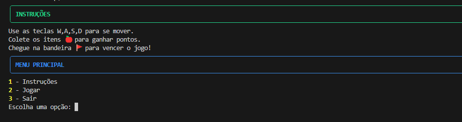

# Trabalho Prático - Jogo do Labirinto
**Nome:** Franciele Freitas  
**Projeto desenvolve Bom Despacho**   

## Sobre o Jogo
"Aventura no Labirinto" é um jogo via terminal onde o jogador explora um labirinto, coleta itens e tenta alcançar a bandeira (🚩).  
O projeto cumpre todos os requisitos do módulo 1: função recursiva, uso de match-case, estrutura modular, CLI funcional e documentação completa.

O jogo toca música de fundo automaticamente, que pode ser desativada com a opção `--disable-sound`. A dificuldade do labirinto pode ser escolhida na inicialização do jogo via argumento `--dificuldade <1|2|3>`. O labirinto é gerado dinamicamente a cada partida, e a movimentação é feita exclusivamente com **W, A, S, D**. Para melhor experiência visual, recomenda-se abrir o terminal em tela cheia. Os itens e a bandeira são destacados para facilitar a navegação e coleta. A documentação HTML permite navegar por todas as funções e módulos, garantindo fácil conferência das docstrings do projeto.

---

## Como Jogar

1. **Menu Inicial**  
Ao abrir o jogo, você verá o menu inicial com as opções **Instruções**, **Jogar** ou **Sair**.  



2. **Movimentação**  
Use **W, A, S, D** para mover o personagem pelo labirinto. O objetivo é coletar itens e alcançar a bandeira (🚩).  


3. **Vitória**  
Ao alcançar a bandeira, o jogo exibirá a tela de vitória, mostrando sua pontuação final.  


4. **Derrota**  
A tela de derrota aparece somente se o jogador perder durante a partida.  


---

## Documentação e Dependências

Toda a documentação do pacote `aventura_pkg` está na pasta `documentacao/`, contendo os HTMLs gerados a partir das docstrings de: `__init__.py`, `labirinto.py`, `jogador.py` e `utils.py`.  
As bibliotecas utilizadas estão listadas no `requirements.txt`. Para instalar, basta rodar:

```bash
pip install -r requirements.txt
